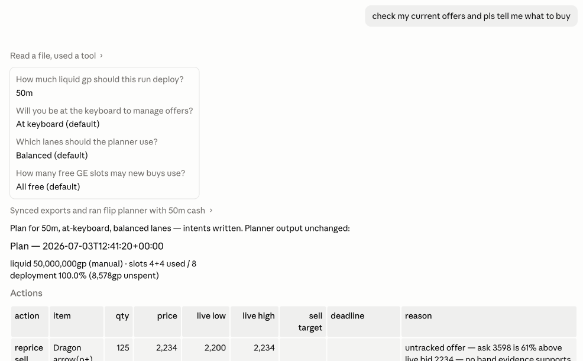
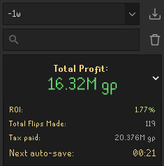

# Evidence-Based Flipping

**An OSRS Grand Exchange flipping advisor.** It reads your Flipping Utilities data, checks OSRS
Wiki prices, and gives you exact buy/sell/cancel/reprice instructions to type into the GE. It
never touches the game: you place every offer yourself.

<p align="center">
  
</p>

Every call records a reason and a prediction (direction, target, deadline), and later runs
check those predictions against what actually filled.

Inspired by Leverage In Action's
["I Tried Using Data Science to Profit in a Video Game Economy"](https://www.youtube.com/watch?v=FhTLApOoWX8).

## Getting started

You need Git, [`uv`](https://docs.astral.sh/uv/), and a coding agent that supports Agent Skills
(Claude Code, Codex, etc.).

1. **Clone and install:**

   ```bash
   git clone git@github.com:sasoder/evidence-based-flipping.git
   cd evidence-based-flipping
   uv sync
   ```

2. **Install the RuneLite plugin fork** —
   [sasoder/rl-plugin](https://github.com/sasoder/rl-plugin). The stock Flipping Utilities
   doesn't export current GE slots or consume intent tags, and without those the planner can't
   see your open offers or attribute fills to its calls. Build and install it, then enable
   auto-save (1 minute interval) and "Export current GE slots" — the fork's
   [Merch harness integration](https://github.com/sasoder/rl-plugin#merch-harness-integration)
   section has screenshots of both settings.

3. **Open this repo in your agent and run `/setup`.** It verifies the plugin wiring and asks
   only for what defaults can't infer: a contact for the OSRS Wiki user-agent, your RSN if you
   have more than one RuneLite profile, and which subreddits the optional research pass reads.
   Answers land in gitignored `config/settings.json`; with one profile and default picks, no
   config is needed at all.

Then just talk to it: *"50m liquid, what should I buy?"*

## Using it

Typical requests, in plain chat:

- **"50m liquid, what should I do?"** — syncs your exports, checks every open offer (hold,
  cancel, collect, or reprice), then fills your free slots and presents one action table.
- **"What should I do with my current offers?"** — open offers only, no liquid gp needed. Offers
  the planner did not place still get checked; a losing sell will not be repriced below
  break-even before its exit deadline, and it shows the loss if you want to sell now.
- **"Going to bed, 120m."** — overnight mode: drops the strategies that need you at the
  keyboard and sizes positions to a 12-hour window.
- **"Only active flips, max 5 slots."** — preferences go straight to the planner as hard
  limits.
- **"Anything being talked about that's worth flipping?"** — optional research pass over the
  OSRS news feed and Reddit. It can re-rank trades that already passed, never invent a trade.

If your message doesn't include the numbers, the agent asks: liquid GP, whether you'll be
around, which strategies, slot cap. A plan looks like this:

| action | item | qty | price | live low | live high | deadline |
|---|---|---:|---:|---:|---:|---|
| reprice sell | Ornate maul handle | 12 | 747,005 | 731,212 | 747,005 | |
| collect | Stymphike feather | 5,000 | 1,789 | | | |
| buy | Halibut | 958 | 2,147 | 2,147 | 2,290 | 21:56 UTC |
| buy | Accursed sceptre (u) | 7 | 6,491,874 | 6,491,874 | 6,822,410 | 23:26 UTC |

Every row shows the item's latest instant-sell/instant-buy prices (live low/high) so you can
check the call, and includes its reason — for row 4: fresh prices on both sides, 318k/unit
net spread after tax, 36 buys/35 sells in the last hour, cancel unfilled after 30m, exit by 90m.

## How it decides

The LLM does not pick trades. The planner (`merch.plan`) does the ranking, sizing, open-offer
checks, and formatting; the agent collects your inputs, runs it once, and reads the result back.

Buy and sell targets come from percentile bands over ~15 days of hourly prices (buy at the 35th
percentile of instant-sells, sell at the 75th of instant-buys), and every margin is after GE
tax. Open offers are checked before anything new is suggested: zero-fill buys cancel after 4h,
old sells move toward the live bid, and the 12h exit is counted even at a loss. The backtest
uses the same exit rule, so the live plan should too.

Each strategy has its own checks:

| strategy | horizon | must pass |
|---|---|---|
| **patient** | 2-12h band flips | trading at the band's buy target *now*; 6h trend check against downtrends (a big margin often means the item is dropping, not bouncing); net positive when the band's rules are replayed over history |
| **active** | 15-90m, items over 1m | fresh two-sided quotes, after-tax margin and ROI floors, real flow on both sides; reports its expected loss if the spread doesn't close |
| **time** | recurring UTC windows | picked on older data, then still profitable on newer data it has not seen |
| **probe** | small near-band experiments | capped at 5% of liquid in total |

Items compete for free slots by expected realized gp/hour, not listed margin: a big spread that
fills once a day loses to a smaller spread that actually moves. Quantity is capped by the GE
limit and estimated fillability, each slot must clear a profit floor, and when the filters leave
liquid unspent the plan says why instead of filling slots for the sake of it.

Each call is written as an intent (item, side, quantity, price, strategy, reason, prediction).
Place that exact offer and the plugin fork tags it; later runs grade the call against your real
fills. Five profitable round trips make an item a personal staple, so the planner is willing to
size it a bit higher, but it still has to pass the same checks.

## CLI

The planner is a plain CLI underneath, if you want a plan without the agent:

```bash
uv run python -m merch.plan --cash 50000000 --strategies active --max-new-slots 5 --write-intents --markdown
```

- `--cash <gp>`: liquid GP to size against. Required.
- `--strategies patient,active,time,probe`: enabled strategies, or presets like `balanced` and `conservative`.
- `--max-new-slots <n>`: cap new offers after checking current offers.
- `--horizon overnight`: drop keyboard-dependent strategies and size for 12h away.
- `--write-intents`: queue exact offer signatures for the plugin fork to tag.

## Runtime data

Your exports and local state stay on disk and out of git:
`data/incoming/flipping/`, `data/incoming/ge-slots/`, `state/offer_ages.json`,
`state/offer_fills.json`.

## Why "Evidence"?

Evidence is my RSN, and the suggestions are evidence-based, so the name was sitting right
there. A week of following the calls on roughly 85m liquid returned about 16m, which would
look more impressive if I wasn't poor.

<p align="center">
  
  
</p>

## Tests

```bash
uv run python -m unittest discover -s tests -v
```
