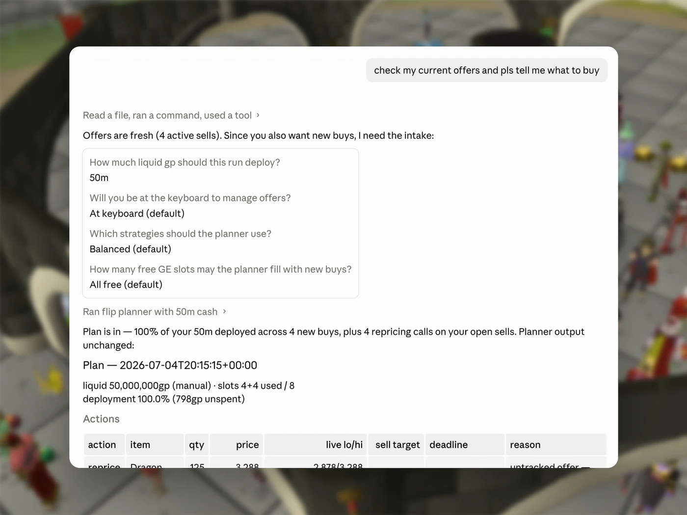
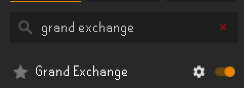
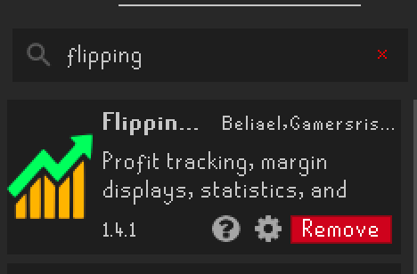
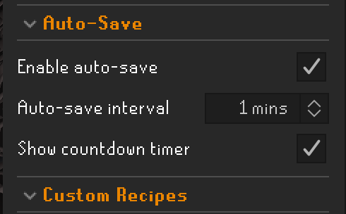

# Evidence-Based OSRS Flipper

[](https://github.com/sasoder/evidence-based-osrs-flipper/actions/workflows/tests.yml)

**Evidence-Based OSRS Flipper is an OSRS Grand Exchange flipping advisor.** It reads RuneLite's
local GE state, checks OSRS Wiki prices, and gives you exact buy/sell/cancel/reprice
instructions to type into the GE. It never touches the game. You still place every offer yourself.


<p align="center">
  
</p>

Each recommendation records why it was made, its target, and its deadline. Later runs reconcile
those instructions with the offers and fills RuneLite observed.

Inspired by Leverage In Action's
["I Tried Using Data Science to Profit in a Video Game Economy"](https://www.youtube.com/watch?v=FhTLApOoWX8).

## Getting started

RuneLite and Python 3.11+ are required. A coding agent like
[Claude](https://claude.com/download) or [Codex](https://openai.com/codex/) is highly recommended,
but you can also use the planner directly from its CLI. The commands below use
[uv](https://docs.astral.sh/uv/). If you already have a Python environment activated, skip `uv run`.

1. **Get the repo.** Clone it, or [download the ZIP](https://github.com/sasoder/evidence-based-osrs-flipper/archive/refs/heads/main.zip) and unzip it.

   ```bash
   git clone https://github.com/sasoder/evidence-based-osrs-flipper.git
   cd evidence-based-osrs-flipper
   ```

2. **Open RuneLite and make sure its built-in Grand Exchange plugin is enabled.** Flipping
   Utilities from the Plugin Hub is optional but highly recommended for faster slot and fill
   updates. Enable auto-save and set its interval to one minute. Only standard RuneLite plugins are
   used.

   <p align="center">
     
     
     
   </p>

3. **Set up the project.** The easiest option is to open the repo in your agent and ask it to handle
   setup. Use `/setup` when your agent supports skill commands, then follow the prompts while it
   checks Python and RuneLite. If you prefer not to use an agent, run the sync and planner commands
   in the CLI section below.

With an agent, you can then ask: *"I have 50m spendable outside the GE. What should I buy?"*

## Using it

Typical requests, in plain chat:

- **"I have 50m spendable outside the GE. What should I do?"**: syncs your data, checks every open offer (hold, cancel, collect, or reprice), then fills free slots. Offer-only review works the same way with no cash: *"what should I do with my current offers?"*
- **"Are the items I usually flip still good right now?"**: if you use Flipping Utilities, it reads your history, re-checks those winners against today's prices and the same gates, and only keeps ones that still clear.
- **"Going to bed, 120m."**: sizes positions for a 12-hour window.
- **"Only active flips, max 5 slots."**: sends those preferences to the planner as hard limits.
- **"Anything being talked about that's worth flipping?"**: checks the OSRS news feed and Reddit for context. Research can re-rank trades that already passed the evidence gates (and is the only way a breaking market gets bought into), but it never invents a trade.

If your message doesn't include the numbers, the agent asks: spendable GP outside GE offers, whether you'll be
around, which strategies, and slot cap. A plan looks like this:


| action | item             | qty | price   | capital   | exp. profit | live lo/hi      | sell target | deadline  | basis                                  |
| ------ | ---------------- | --- | ------- | --------- | ----------- | --------------- | ----------- | --------- | -------------------------------------- |
| buy    | Topaz amulet (u) | 439 | 3,153   | 1,384,167 | 29,852      | 3,153/3,300     | 3,293       | 19:43 UTC | time-of-day, cancel zero-fill after 6h |
| buy    | Granite maul     | 4   | 149,001 | 596,004   | 12,856      | 149,000/156,501 | 156,500     | 21:13 UTC | active, cancel unfilled after 30m      |


Every row includes the latest instant-sell/instant-buy prices (`live lo/hi`), the gp the offer
commits (`capital`), and its expected after-tax profit, so you can check the call before placing it.

## How it decides

The agent does not pick trades itself. A deterministic planner checks your open offers first, then
ranks and sizes new trades using current prices, recent history, liquidity, GE tax, and downside.
Weak opportunities are rejected rather than used to fill slots.


| strategy    | approach                                      |
| ----------- | --------------------------------------------- |
| **patient** | Buy near a historical band and hold for hours |
| **active**  | Short, liquid flips with fresh two-sided flow |
| **time**    | Recurring opportunities at specific UTC hours |
| **probe**   | Small tests of promising patient entries     |


Every recommendation is an exact order with a reason, target, and deadline. Later runs reconcile
it with real offers and fills, including partial fills and completed trades, so the planner can
hold, cancel, collect, reprice, or sell the position as conditions change.

## CLI

The planner is a plain CLI underneath, if you want a plan without the agent:

```bash
uv run python -m flipper.sync
uv run python -m flipper.plan --cash 50000000 --strategies active --max-new-slots 5 --write-intents --markdown
```

- `--cash <gp>`: spendable GP currently outside GE offers. This is required. The planner automatically adds proceeds and refunds from collect or cancel actions.
- `--strategies patient,active,time,probe`: enabled strategies, or presets like `balanced` and `conservative`.
- `--max-new-slots <n>`: cap new offers after checking current offers.
- `--horizon overnight`: disable strategies that need you at the keyboard and size positions for 12h away.
- `--write-intents`: queue order identities, intended prices, and evidence for the next sync.
- `--report-personal-history`: show historical FU items that did not clear today's checks.

## Runtime data

Your RuneLite snapshot, optional Flipping Utilities history, and reconciled offer state stay on
disk and out of git: `data/incoming/runelite/`, `data/incoming/flipping/`, and `state/`.
On Windows, RuneLite's default data directory is `%USERPROFILE%\.runelite`. The app finds it
automatically. If yours is somewhere else, set `RUNELITE_HOME`.

## Why "Evidence"?

Evidence is my RSN, the suggestions are evidence-based, and the rest of the name describes what
it does. A week of following the calls on around 85m liquid returned about 16m, mostly between
Sailing sessions and whenever I got around to the GE, which would look more impressive if I
wasn't poor.

<p align="center">
  
  
</p>

## Tests

```bash
uv run python -m unittest
```

## Contributing

Pull requests are welcome. Read `AGENTS.md`, keep trade selection inside the deterministic planner,
run the test suite above, and never commit files from `data/incoming/`, `state/`, or
`config/settings.json`.
